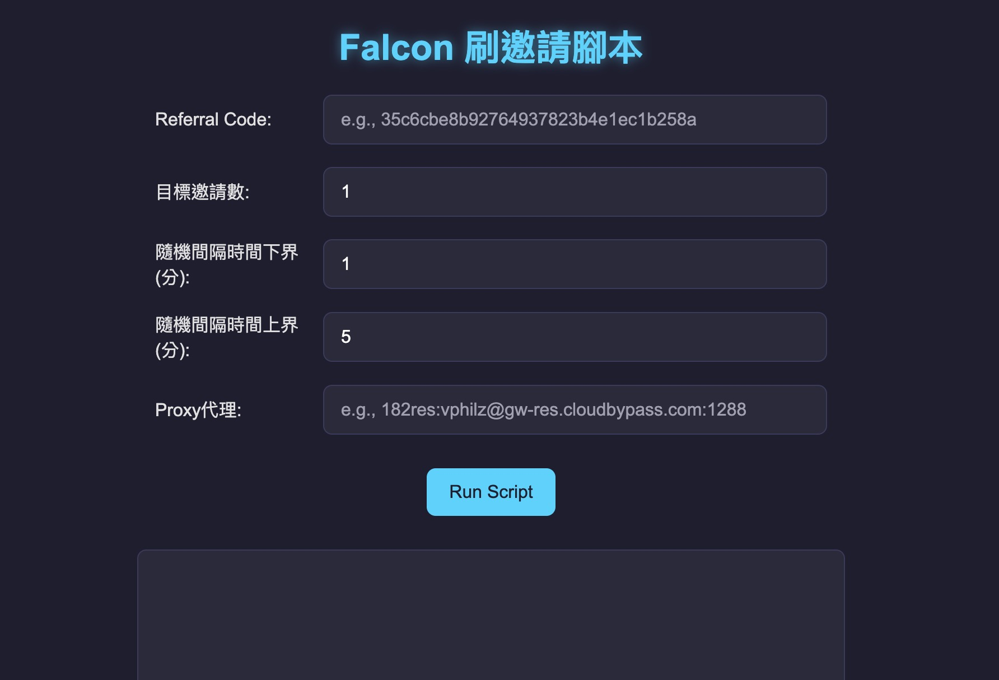
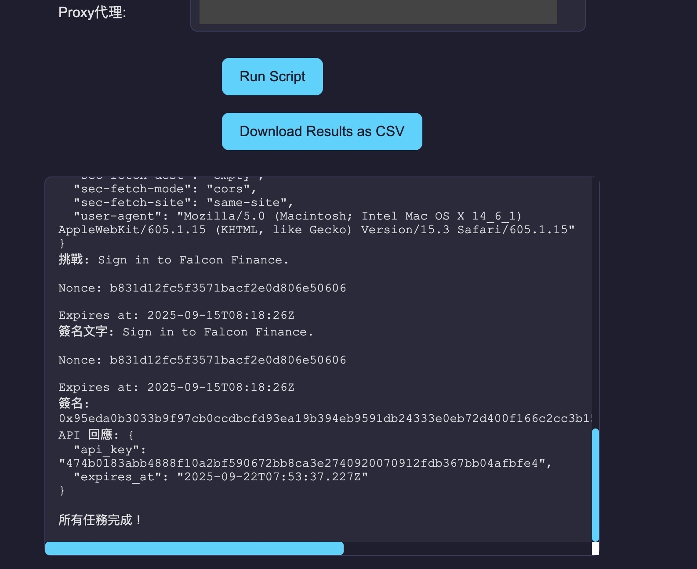

# Falcon-public-
沒啥好講的，HTML腳本適配所有Mac、Windows系統  
下載下來雙擊打開即可  
**聯繫作者取得權限後到[這邊](https://github.com/jason2290/Falcon)就能看到腳本**  
IP推薦[這個](https://www.cloudbypass.com/pricing.html)。選擇住宅的，新註冊應該有試用

## 介面範例  
  

## 下載錢包
執行完畢後在下方會生成按鈕可以下載腳本執行時生成並使用的金鑰和地址  
腳本執行中金鑰沒有加密，**不建議將這些錢包使用在真實用途之中**

